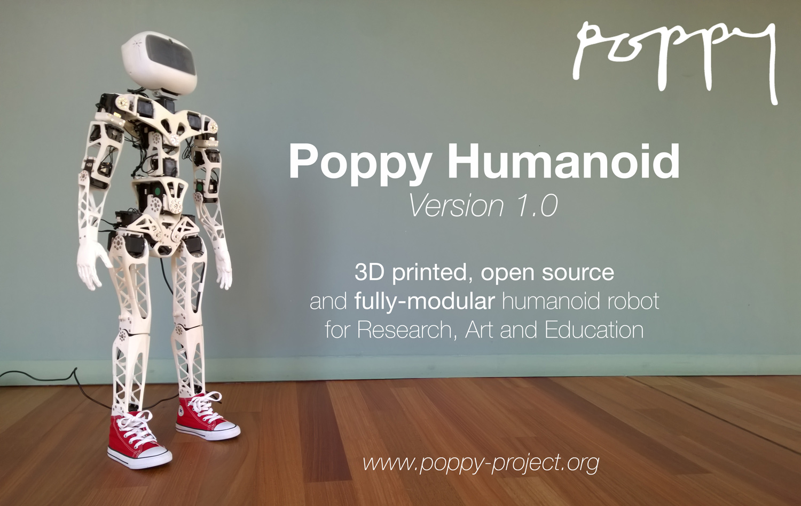

Poppy Humanoid
===================
Poppy is an open source platform dedicated to the conception of animated robotic creature.



The first and most advanced creature is the fully 3D printed Poppy Humanoid.

## Presentation

Poppy Humanoid is an open-source and 3D printed humanoid robot. Optimized for research and education purposes, its modularity allows for a wide range of applications and experimentations.

### Open Source

All the technological development work made in the Poppy project is freely available under open source licenses. Only the name usage *"Poppy"* is restricted and protected as an international trademark, please contact us if you want to use it or have more information.


|   License     |     Hardware    |   Software      |
| ------------- | :-------------: | :-------------: |
| title  | [Creatives Commons BY-SA](http://creativecommons.org/licenses/by-sa/4.0/)  |[GPL v3](http://www.gnu.org/licenses/gpl.html)  |
| logo  | [ ](http://creativecommons.org/licenses/by-sa/4.0/)  |[](http://www.gnu.org/licenses/gpl.html)  |


**Please keep references to the [Poppy project (www.poppy-project.org)](www.poppy-project.org) and [authors](doc/authors.md) when you use or fork this work.**


### 3D Printed
*TODO*


### Fully-Modular
*TODO*

### Community
*TODO*


## Build your own Poppy Humanoid

Building a complete Poppy Humanoid costs $8000-9000 with about 60% for buying the 25 Robotis Dynamixel actuators required. The full BOM is available here >> [Bill Of Material](hardware/doc/BOM.md)


Then the process to assemble a complete Poppy Humanoid takes about 7h for  handyman people. Yet the skills required are very limited and should not be a problem for anyone able to hold a screwdriver.

[](hardware/doc/Poppy_Humanoid_assembly_instructions.md)

The assembly process is fully documented with video tutorials.
### [Go to the Poppy Humanoid assembly documentation >>](hardware/doc/Poppy_Humanoid_assembly_instructions.md)

## Support
You need support ?
The [Poppy forum](forum.poppy-project.org) is the best (and single) place to ask for help !

## Contribution
*TODO*

<!-- ## Software

The software can be directly installed via
```bash
pip install poppy_humanoid
```
Or it can be download as a [release](https://github.com/poppy-project/Poppy-Humanoid/releases/download/1.0-pre-release/poppy-humanoid-1.0rc2.tar.gz).


It is -->


## The Poppy project history

The Poppy project is born in 2012 in the [Flowers laboratory](flowers.inria.fr) at [Inria Bordeaux Sud-Ouest](http://www.inria.fr/en/centre/bordeaux).
It was initiated during [Matthieu Lapeyre](github.com/matthieu-lapeyre)'s PhD Thesis surpervised by [Pierre Yves Oudeyer](http://www.pyoudeyer.com/). At the beginning, the development team was composed by Matthieu Lapeyre (mechanics & design), [Pierre Rouanet](github.com/pierre-rouanet) (software) and [Jonathan Grizou](http://jgrizou.com/) (electronics).

This project is initially a fundamental research project financed by [ERC Grant Explorer](http://erc.europa.eu/) to explore the role of embodiement and morphology properties on cognition and especially on the learning of sensori-motor tasks.


### More on the project

- [Website](https://www.poppy-project.org)
- [Twitter](https://twitter.com/poppy_project)
- [Flickr](flickr.com/photos/poppy-project/)
- [Vimeo](https://vimeo.com/poppyproject)
