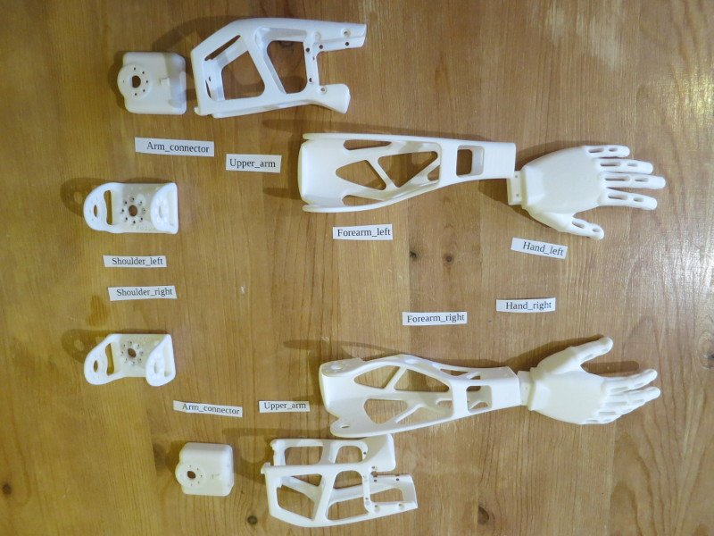

## Arms assembly

\

Motors lists:

| Sub-assembly name       	|  Motor name  	|   Type  	| ID 	|
|-------------------------	|:------------:	|:-------:	|:--:	|
| Left upper arm/shoulder 	| l\_shoulder\_x 	| MX-28AT 	| 42 	|
| Left upper arm          	|   l\_arm\_z  	| MX-28AT 	| 43 	|
| Left upper arm          	|  l\_elbow\_y 	| MX-28AT 	| 44 	|

| Sub-assembly name        |   Motor name   |   Type  | ID |
|--------------------------|:--------------:|:-------:|:--:|
| Right upper arm/shoulder | r\_shoulder\_x | MX-28AT | 52 |
| Right upper arm          |    r\_arm\_z   | MX-28AT | 53 |
| Right upper arm          |   r\_elbow\_y  | MX-28AT | 54 |

**Reminder**: be careful with orientation while mounting [Dynamixel horns](dynamixel_hardware.md)

-   **[Right](https://github.com/poppy-project/Poppy-basic-arms/blob/master/doc/subassemblies/right_forearm_assembly_instructions.md)/[Left](https://github.com/poppy-project/Poppy-basic-arms/blob/master/doc/subassemblies/left_forearm_assembly_instructions.md)
    forearm** The hand design slightly changed from the videos, but the
    nuts and screws remain the same.

    

-   **[Right](https://github.com/poppy-project/Poppy-basic-arms/blob/master/doc/subassemblies/right_upper_arm_assembly.md)/[Left](https://github.com/poppy-project/Poppy-basic-arms/blob/master/doc/subassemblies/left_upper_arm_assembly.md)
    upper arm** Plug a 200mm cable in the unused plug before screwing
    the arm\_z motors (ids 43 and 53), because it will be really hard to
    plug once the motor is inside the structure part.

-   **[Right](https://github.com/poppy-project/Poppy-basic-arms/blob/master/doc/subassemblies/right_upper_arm_shoulder_assembly.md)/[Left](https://github.com/poppy-project/Poppy-basic-arms/blob/master/doc/subassemblies/left_upper_arm_shoulder_assembly.md)
    upper arm/shoulder**

-   **[Right](https://github.com/poppy-project/Poppy-basic-arms/blob/master/doc/right_arm_assembly_instructions.md)/[Left](https://github.com/poppy-project/Poppy-basic-arms/blob/master/doc/left_arm_assembly_instructions.md)
    arm assembly**

-   **[Trunk and arms
    assembly](https://github.com/poppy-project/poppy-humanoid/blob/master/hardware/doc/Poppy_Humanoid_assembly_instructions.md)**
    To distinguish between left and right shoulder parts, look at the
    three dots: the single dot should be down when the shoulder is in
    “zero” position (along the shoulder\_y motor).

[**<< Back to menu**](assemblyGuide.md)

[**Trunk assembly >>**](trunk_assembly.md)
