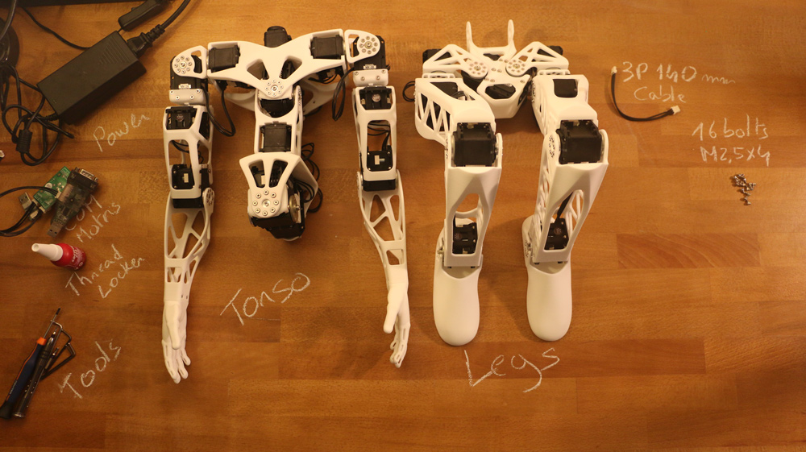

## Legs assembly

There is only a video for left leg assembly. While assembling the right
leg, be sure to put your motors symmetrical compared to the left leg.
Also don’t forget to change the motors IDs from 12-15 to 22-25.

Motors lists:

| Sub-assembly name |  Motor name |   Type  | ID |
|-------------------|:-----------:|:-------:|:--:|
| Pelvis            |  l\_hip\_x  | MX-28AT | 11 |
| Left hip          |  l\_hip\_z  | MX-28AT | 12 |
| Left hip          |  l\_hip\_y  | MX-64AT | 13 |
| Left thigh        |  l\_knee\_y | MX-28AT | 14 |
| Left shin         | l\_ankle\_y | MX-28AT | 15 |

| Sub-assembly name |  Motor name |   Type  | ID |
|-------------------|:-----------:|:-------:|:--:|
| Pelvis            |  r\_hip\_x  | MX-28AT | 21 |
| Right hip         |  r\_hip\_z  | MX-28AT | 22 |
| Right hip         |  r\_hip\_y  | MX-64AT | 23 |
| Right thigh       |  r\_knee\_y | MX-28AT | 24 |
| Right shin        | r\_ankle\_y | MX-28AT | 25 |

**Reminder**: be careful with orientation while mounting [Dynamixel horns](dynamixel_hardware.md)

-   **[Hip](https://github.com/poppy-project/Poppy-lightweight-biped-legs/blob/master/doc/subassemblies/left_hip_assembly_instructions.md)**

-   **[Tight](https://github.com/poppy-project/Poppy-lightweight-biped-legs/blob/master/doc/subassemblies/left_thigh_assembly_instructions.md)**

-   **[Shin](https://github.com/poppy-project/Poppy-lightweight-biped-legs/blob/master/doc/subassemblies/left_shin_assembly_instructions.md)**
    If you received your Poppy kit from Generation Robots, you can use
    the custom 220mm cables instead of really short 200mm cables.

-   **[Right](https://github.com/poppy-project/Poppy-lightweight-biped-legs/blob/master/doc/subassemblies/right_leg_assembly_instructions.md)/[Left](https://github.com/poppy-project/Poppy-lightweight-biped-legs/blob/master/doc/subassemblies/left_leg_assembly_instructions.md)
    leg assembly**

-   **[Pelvis](https://github.com/poppy-project/Poppy-lightweight-biped-legs/blob/master/doc/subassemblies/pelvis_assembly_instructions.md)**
    The videos shows M2x5mm screws. Use the M2x6mm screws that you can
    find in the Bolt-nut set BNS-10.

-   **[Torso and legs
    assembly](https://github.com/poppy-project/poppy-humanoid/blob/master/hardware/doc/Poppy_Humanoid_assembly_instructions.md)**

### Legs/Torso assembly
- Preparation: 5 min
- Assembly: 5-10 min

#### Requirement:

**Sub-assemblies**
- Legs
- Torso

**Robotis parts:**
- 16x Bolts M2.5x4

**Cables:**
- 1x 3P 140mm

**Motor configuration:**
- 1x Alimentation 12V
- 1x SMPS2Dynamixel
- 1x USB2Dynamixel or USB2AX
- A computer...

#### <a href="http://youtu.be/5i0xVlrJc-8" target="_blank">**VIDEO INSTRUCTIONS**</a>

[**<< Back to menu**](assemblyGuide.md)

[**Trunk assembly >>**](trunk_assembly.md)
