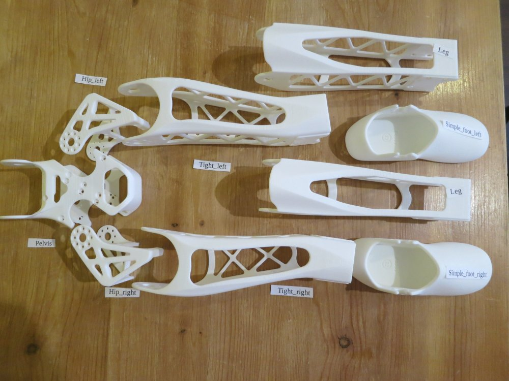

# Assemblage des jambes

**Etapes:**
1. Pelvis
2. Jambe gauche
3. Jambe droite
4. Assemblages des jambes
5. Assemblage avec le torso

**Pièces imprimées en3D:**

**Rappel** : faites attention à l'orientation quand vous montez les [palonniers Dynamixel](materiel_dynamixel.md)

## 1. Pelvis:

| Nom du sous-assemblage   | Nom anglais    	|  Nom du moteur|   Type  	| ID 	|
|-------------------|:-----------:|:-----------:|:-------:|:--:|
| Pelvis          | Pelvis            |  l\_hip\_x  | MX-28AT | 11 |
| Pelvis            | Pelvis            |  r\_hip\_x  | MX-28AT | 21 |

/!\ La vidéo montre des vis \M2x5mm. Vous pouvez utiliser les vis M2x6mm que vous trouvez dans le set Bolt-nut set BNS-10.
####[Instructions pour l'assemblage du pelvis >>](https://github.com/poppy-project/Poppy-lightweight-biped-legs/blob/master/doc/subassemblies/pelvis_assembly_instructions.md)

## 2. Jambe gauche:

| Nom du sous-assemblage   | Nom anglais    	|  Nom du moteur|   Type  	| ID 	|
|-------------------|:-----------:|:-----------:|:-------:|:--:|
| Hanche gauche          | Left hip          |  l\_hip\_z  | MX-28AT | 12 |
| Hanche gauche          | Left hip          |  l\_hip\_y  | MX-64AT | 13 |
| Cuisse gauche          | Left thigh        |  l\_knee\_y | MX-28AT | 14 |
| Mollet gauche          | Left shin         | l\_ankle\_y | MX-28AT | 15 |

### Instructions d'assemblage

-   **[Hanche gauche](https://github.com/poppy-project/Poppy-lightweight-biped-legs/blob/master/doc/subassemblies/left_hip_assembly_instructions.md)**

-   **[Cuisse gauche](https://github.com/poppy-project/Poppy-lightweight-biped-legs/blob/master/doc/subassemblies/left_thigh_assembly_instructions.md)**

-   **[Mollet gauche](https://github.com/poppy-project/Poppy-lightweight-biped-legs/blob/master/doc/subassemblies/left_shin_assembly_instructions.md)** 
Si vous avez reçu votre robot de Génération Robots, vous pouvez utiliser les câbles spéciaux de 220mm au lieu des câbles de 200mm qui sont très justes.

### [Assemblage de la jambe gauche >>](https://github.com/poppy-project/Poppy-lightweight-biped-legs/blob/master/doc/subassemblies/left_leg_assembly_instructions.md)

## 3. Jambe droite:

| Nom du sous-assemblage   | Nom anglais    	|  Nom du moteur|   Type  	| ID 	|
|-------------------|:-----------:|:-----------:|:-------:|:--:|
| Hanche droite         | Right hip         |  r\_hip\_z  | MX-28AT | 22 |
| Hanche droite         | Right hip         |  r\_hip\_y  | MX-64AT | 23 |
| Cuisse droite         | Right thigh       |  r\_knee\_y | MX-28AT | 24 |
| Mollet droit         | Right shin        | r\_ankle\_y | MX-28AT | 25 |

## Instructions d'assemblage

-   **[Hanche droite](https://github.com/poppy-project/Poppy-lightweight-biped-legs/blob/master/doc/subassemblies/right_hip_assembly_instructions.md)**

-   **[Cuisse droite](https://github.com/poppy-project/Poppy-lightweight-biped-legs/blob/master/doc/subassemblies/right_thigh_assembly_instructions.md)**

-   **[Mollet droit](https://github.com/poppy-project/Poppy-lightweight-biped-legs/blob/master/doc/subassemblies/right_shin_assembly_instructions.md)** 
Si vous avez reçu votre robot de Génération Robots, vous pouvez utiliser les câbles spéciaux de 220mm au lieu des câbles de 200mm qui sont très justes.

### [Assemblage de la jambe gauche >>](https://github.com/poppy-project/Poppy-lightweight-biped-legs/blob/master/doc/subassemblies/right_leg_assembly_instructions.md)

## 4. [Assemblage jambe/pelvis>>](https://github.com/poppy-project/Poppy-lightweight-biped-legs/blob/master/doc/legs_assembly_instructions.md)

###  5. Assemblage jambes-torse
- Preparation: 5 min
- Assemblage: 5-10 min

#### Matériel:

**Sous-assemblages**
- Jambes
- Torse

**Elements Robotis:**
- 16x Vis et écrous M2.5x4

**Cables:**
- 1x 3P 140mm

**Configuration des moteurs:**
- 1x Alimentation 12V
- 1x SMPS2Dynamixel
- 1x USB2Dynamixel or USB2AX
- Un ordinateur...

#### <a href="http://youtu.be/5i0xVlrJc-8" target="_blank">**INSTRUCTIONS VIDEO**</a>

[**<< Retour au menu**](guideAssemblage.md)

[**Assemblage du tronc >>**](assemblage_tronc.md)

