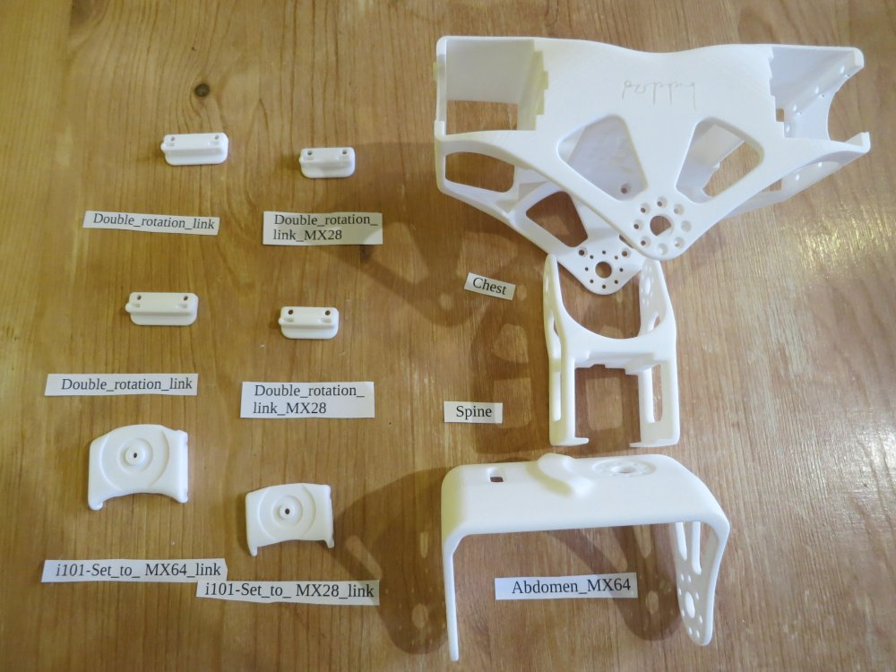

# Assemblage du tronc

Liste des moteurs:

| Nom du sous-assemblage   | Nom anglais    	|  Nom du moteur|   Type  	| ID 	|
|-------------------|:--------------:|:-------:|:--:|
| Double MX64       | Double MX64       |     abs\_y     | MX-64AT | 31 |
| Double MX64       | Double MX64       |     abs\_x     | MX-64AT | 32 |
| Colonne vertébrale       | Spine             |     abs\_z     | MX-28AT | 33 |
| Double MX28       | Double MX28       |     bust\_y    | MX-28AT | 34 |
| Double MX28       | Double MX28       |     bust\_x    | MX-28AT | 35 |
| Poitrine       | Chest             |     head\_z    |  AX-12A | 36 |
| Poitrine       | Chest             | l\_shoulder\_y | MX-28AT | 41 |
| Poitrine       | Chest             | r\_shoulder\_y | MX-28AT | 51 |

**Rappel** : faites attention à l'orientation quand vous montez les [palonniers Dynamixel](materiel_dynamixel.md)

-   **[Double
    MX64](https://github.com/poppy-project/Robotis-library/blob/master/doc/en/double_MX64_assembly.md)**

-   **[Double
    MX28](https://github.com/poppy-project/Robotis-library/blob/master/doc/en/double_MX28_assembly.md)**
    N'attachez pas le i101-Set_to_ MX28_link (la pièce en plastique avec un palonnier libre dessus) trop serré ou ne l'attachez pas du tout, car il faut le détacher pendant l'assemblage du tronc.

-   **[Colonne vertébrale](https://github.com/poppy-project/Poppy-multiarticulated-torso/blob/master/doc/en/subassembly/spine_assembly_instructions.md)**

-   **[Poitrine](https://github.com/poppy-project/Poppy-multiarticulated-torso/blob/master/doc/en/subassembly/chest_assembly_instructions.md)** La vidéo montre un HN07\_I101 dans les pièces préparées, mais vous n'en avez pas besoin.

-   **[Assemblage du tronc](https://github.com/poppy-project/Poppy-multiarticulated-torso/blob/master/doc/en/5_DoFs_humanoid_spine.md)** Vous devez insérer les écrous dans la poitrine avant de monter le double MX-28. Vous devez également mettre les écrous dans l'abdomen avant de monter le double MX-64.

	La pièce "abdomen" a un marquage "Poppy" dans le dos alors que celle sur la vidéo n'en a pas. Il y a des trous qui permettent de visser le SMPS2Dynamixel pour éviter de le coller (utilisez des vis M2.5x8mm).

	

##  Assemblage du tronc et des bras:

- Preparation: 5 min
- Assemblage: 15-20 min

### Matériel

**Sous-assemblages:**
- Tronc
- Bras gauche
- Bras droit

**Pièces imprimées en 3D:**
- Left shoulder
- right shoulder

**Cables:**
- 2x 3P 200mm

**Elements Robotis:**
- 48x vis et écrous M2x3

**Configuration des moteurs:**
- 1x Alimentation 12V
- 1x SMPS2Dynamixel
- 1x USB2Dynamixel ou USB2AX
- Un ordinateur...

### <a href="http://youtu.be/uDhLIS3vxM4" target="_blank">**INSTRUCTIONS VIDEO**</a>

[**<< Retour au menu**](guideAssemblage.md)

[**Assemblage des bras >>**](assemblage_bras.md)

[**Assemblage des jambes >>**](assemblage_jambes.md)

[**Assemblage de la tête >>**](assemblage_tete.md)