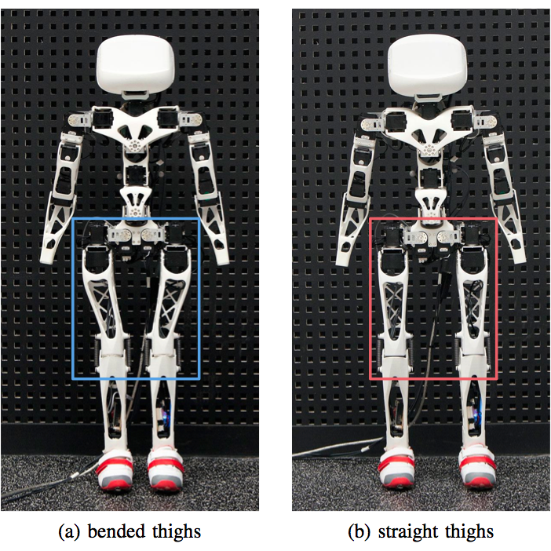

# Guide d'assemblage pour le robot Poppy Humanoid

Auteur : [Manon Cortial, Génération Robots](http://www.generationrobots.com/fr/278-le-robot-poppy-humanoid)

 

# Introduction

## Le projet Poppy

Poppy est un projet de robotique open-hardware et open-source. Il a été créé dans le but de fournir aux chercheurs et aux étudiants des robots dont toutes les pièces sont facilement remplaçables.

Par exemple, des jambes de formes différentes ont été testées sur le robot Poppy Humanoid pour le faire marcher.

## Consignes de sécurité

Le robot Poppy Humanoid est construit principalement avec des moteurs Dynamixel MX-28, qui sont assez puissant et peuvent vous blesser ou abimer votre matériel.

Soyez donc très prudent et ne testez vos programmes que lorsque le robot est dans un endroit dégagé.

## A propos de cette documentation

Cette documentation vous guidera tout au long de l'assemblage de votre robot Poppy Humanoid. Elle contient les liens vers les vidéos de montage, mais aussi des images pour vous aider à identifier les différentes pièces et des conseils.

Commencez par vous familiariser avec le matériel Dynamixel et de la façon de le monter ([Materiel Dynamixel](materiel_dynamixel.md)), ainsi qu'un guide de paramétrage des moteurs ([Adressage des Dynamixel](adressage_dynamixel.md)).

N'hésitez pas à améliorer cette documentation et à signaler les erreurs sur ce [sujet](https://forum.poppy-project.org/t/quickstart-assembly-and-programming-plus-some-code-examples/1228) du forum Poppy.

# Contenu

- [**Materiel Dynamixel >>**](materiel_dynamixel.md)
- [**Adressage des Dynamixel >>**](adressage_dynamixel.md)
- [**Assemblage des bras >>**](assemblage_bras.md)
- [**Assemblage du tronc >>**](assemblage_tronc.md)
- [**Assemblage des jambes >>**](assemblage_jambes.md)
- [**Assemblage de la tête >>**](assemblage_tete.md)

# Liens utiles

## Instructions d'assemblage

<https://github.com/poppy-project/poppy-humanoid/blob/master/hardware/doc/Poppy_Humanoid_assembly_instructions.md>

Liste du matériel:

<https://github.com/poppy-project/Poppy-lightweight-biped-legs/blob/master/doc/BOM.md>

## Forum et docs

Site du projet Poppy: <https://www.poppy-project.org/>

Forum du projet Poppy: <https://forum.poppy-project.org/>

Doc. de herborist: <http://poppy-project.github.io/pypot/herborist.html>

Doc. de Dynamixel wizard: <http://support.robotis.com/en/software/roboplus/dynamixel_monitor/quickstart/dynamixel_monitor_connection.htm>

Logiciel Bonjour: <https://support.apple.com/kb/DL999?locale=fr_FR&viewlocale=fr_FR>

Fichiers STL: <https://github.com/poppy-project/poppy-humanoid/releases/download/Official_1.0_Hardware_release/STL_3D_printed_parts.zip>

