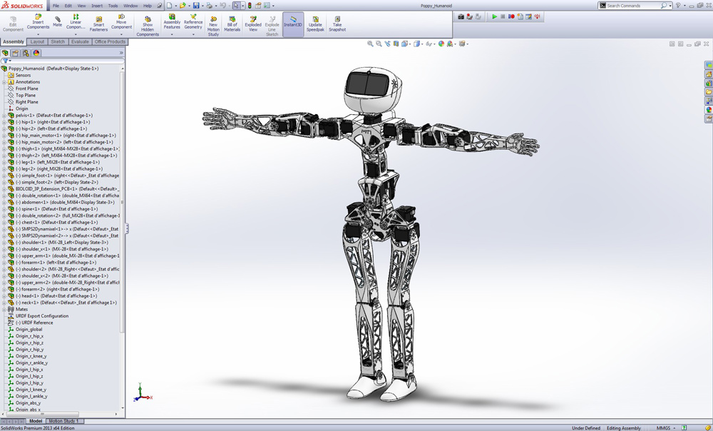
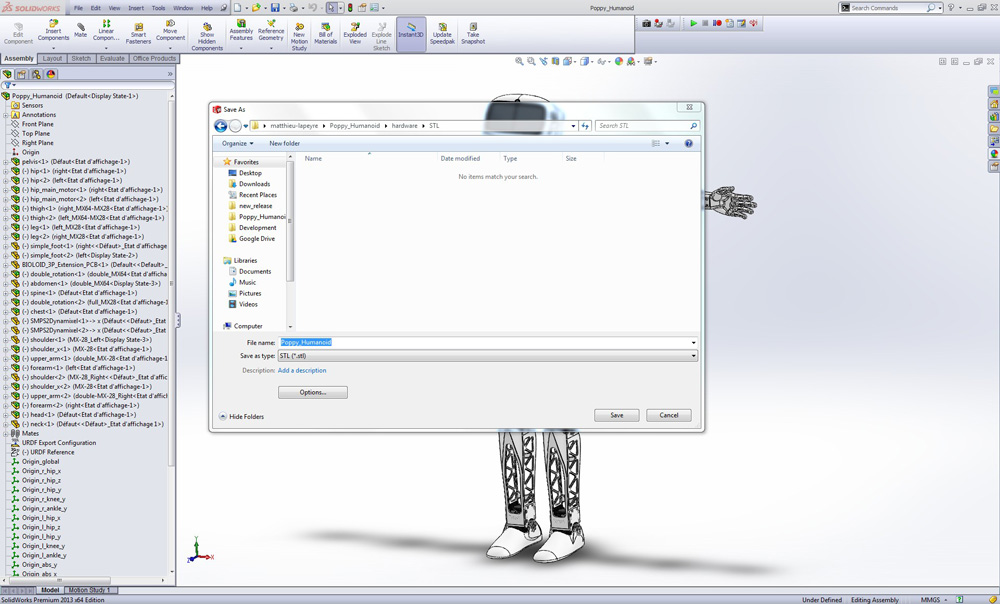
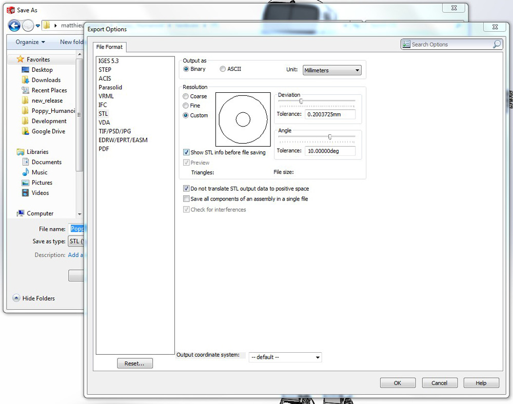
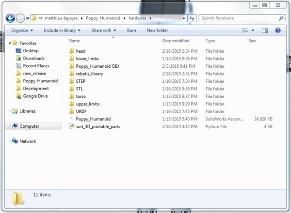
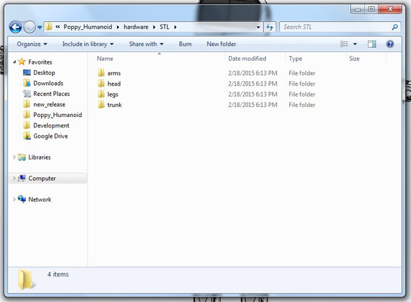

# How to export 3D printable files from Poppy Humanoid SolidWorks model

The 3D printable parts of a Poppy Humanoid are available as a zip folder in the [releases](https://github.com/poppy-project/Poppy-Humanoid/releases).

Yet, if you want to regenerate these files for any reasons (e.g. changes on the structure, change the resolution, change the unit, and so on), this short tutorial will explain how to extract from the SolidWorks model of Poppy Humanoid, the STL files of the parts which have to be 3D printed.

- So open Poppy_Humanoid.SLDASM

## Step 1 - Save the Poppy Humanoid assembly as STL files

- Click on `File > Save As` in the Solidworks interface.
- This panel should appear:
  
- Select `...poppy_humanoid\hardware\STL` as output folder.
- The filename is not important, keep the one suggested by Solidworks.
- Select **STL (*.stl)** in the field `Save as Type`
- Click on the `Options` button.
- This panel should appear:
  
- Select **Millimeters** for the `Unit` field.
- You can tune the output quality in the Resolution fields.
- **/!\** Ensure the case `Save all components of an assembly in a single file` **is not checked!**
- Click on button `Ok`.
- Click on button `Save`.
- Soldiworks should not respond for a while, so be patient until it finishes to generate the STL files.
- A new panel should appear to confirm the exportation, click `Yes`

## Step 2 - extract the 3D printed parts from the exported files

The export should have generated a bunch of STL files (near 200) but most of them are useless and unfortunately the naming made difficult to recognize which part should be kept or not.

To overcome this issue, we have written a quick and dirty python script to extract only the parts to be 3D printed and rename them appropriately.

*If you use windows, please check if you have python, if not you can download the version 2.7 [here](https://www.python.org/downloads/).*

On windows, double click on the `extract_3D_printable_STL_parts.py`, a black terminal windows should pop-up and desappears quickly.

If everything goes right, you have now a STL folder including subfolders associated with each Poppy Humanoid modules (i.e. head, trunk, upper_limbs and lower_limbs):

For example in the trunk folder:

These files are named as described in the [BOM](BOM.md).

## Notes

### Need more support ?

If this tutorial does not work properly on your system, you can either create a new issue in this repository or ask for help our awesome (and handsome) [Discourse forum](//forum.poppy-project.org).

### Want to contribute ?

We are not expert, we do stuffs that eventually work... If you want to contribute and improve this tutorial or the (ugly) script to extract the correct 3D printed parts, you are very welcomed!

As usually, you can fork this repo, do your changes and create a pull request. You can also come on the [forum](//forum.poppy-project.org) and share your ideas!
